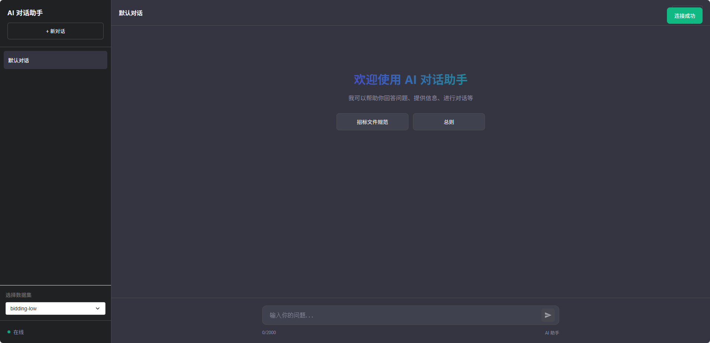

# ragproject
rag学习项目
启动[app.py](RAG_Chromadb%2Fai_chat_app%2Fapp.py)为一个简单的web访问模式，没有做登录及历史记录回溯

启动[test_playround.py](RAG_Chromadb%2Flayout%2Ftest_playround.py)为对话框独立程序本地测试

[test.py](RAG_Chromadb%2Ftest.py)中test2为导入文档数据到并向量化到chromadb

项目支持多种分块方法，[HybridChunker.py](HybridChunker.py)中OptimizedChunker类
接入硅基流动嵌入模型及大语言模型

基于语义的文本分块：SemanticChunkerLCH
基于结构化的文本分块：StructuredChunker
基于大模型的文本分块：LLMBasedChunker
递归分块：RecursiveChunker
